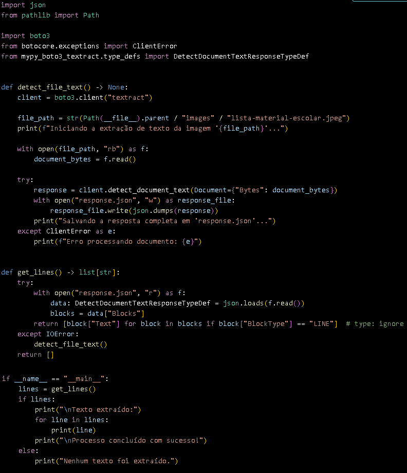
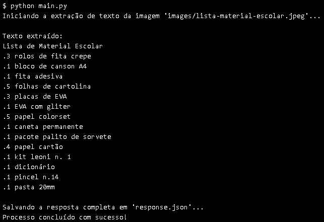

# 📝 OCR Lista Escolar

Um projeto Python que utiliza AWS Textract para extrair texto de imagens de listas de material escolar.

## 🎯 Objetivo

Automatizar a extração de texto de imagens de listas de material escolar usando o serviço Amazon Textract, convertendo conteúdo visual em dados de texto estruturados.

## 🛠️ Tecnologias Utilizadas

- Python 3.13+
- AWS Textract
- boto3
- mypy-boto3-textract

## 📋 Pré-requisitos

- Conta AWS configurada com credenciais de acesso
- Python 3.13 ou superior
- Gerenciador de pacotes `uv` ou `pip`

## 🔧 Instale as dependências:

```bash
uv pip install -e .
# ou
pip install -e .
```

## 🚀 Como usar

1.Coloque sua imagem na pasta [images](images/) com o nome lista-material-escolar.jpeg
 *ou*
 Altere o nome do imagem dentro do código python, na variável `file_path` dentro da função `detect_file_text`, na linha `11`

2. Execute o script principal:
 ```bash
 python main.py
 ```
 

3. O texto extraído será exibido no console e os dados brutos da resposta do AWS Textract serão salvos em [response.json](response.json)
 

## 🔍 Como funciona

O projeto utiliza duas funções principais:

`detect_file_text():`

 - Inicializa o cliente AWS Textract
 - Lê a imagem do arquivo
 - Envia para processamento
 - Salva a resposta em JSON

`get_lines():`

 - Lê o arquivo JSON de resposta
 - Extrai apenas as linhas de texto detectadas
 - Retorna uma lista de strings

## 💡 Insights

### Casos de Uso

1. Automatização de Processos Educacionais:

 - Utilização em escolas para digitalizar listas de materiais escolares, facilitando a distribuição e o controle de estoque.
 - Aplicação em bibliotecas para digitalizar listas de livros e materiais didáticos.

2. Integração com Sistemas de Gestão:

 - Integração com sistemas de gestão escolar para atualizar automaticamente os registros de materiais necessários para cada turma.

### Otimização

1. Interface Gráfica
 - Desenvolvimento de uma interface gráfica para facilitar o upload de imagens e a visualização dos resultados.

2. Suporte a Múltiplos Formatos de Imagem
 - Adicionar suporte para diferentes formatos de imagem (PNG, TIFF, etc.) além do JPEG.

3. Armazenamento em Banco de Dados
 - Salvar os dados extraídos em um banco de dados para facilitar consultas e análises futuras.

### Formas Práticas de Uso 

1. Serviço Web
 - Transformar a aplicação em um serviço web onde os usuários podem fazer upload de imagens e receber os textos extraídos via API.

2. Análise de Dados
 - Utilizar os dados extraídos para realizar análises de consumo de materiais escolares, ajudando na previsão de demanda e otimização de compras.